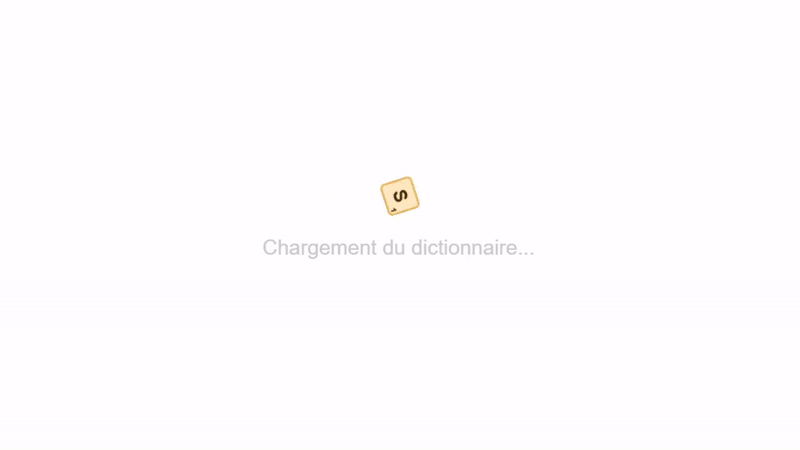

# Dictionnaire du Scrable Web (ODS 9)

### Ce projet est actuellement en ligne à l'adresse: [cjosse.com/dicoscrabble](https://cjosse.com/dicoscrabble/)

Ce projet vise à simplifier la vérification de la validité d'un mot dans la variante française du Scrabble selon la neuvième édition de l'Officiel du Scrabble du 1er janvier 2024
 
